# Dataset 1 - Standard (ST) Protocol

## 1. Overview
Below are the command we're using to process standard protocol dataset of person A 

## 2. Preprocessing

### 2.1. Preprocessing .nii to .mif file format 

https://andysbrainbook.readthedocs.io/en/latest/MRtrix/MRtrix_Course/MRtrix_03_DataFormats.html

- We use the command ``mrconvert`` to combine the raw diffusion data with its corresponding .bval and .bvec files, so that we can use the combined file for future preprocessing steps:

```console
mrconvert dwi.nii.gz dwi_raw.mif -fslgrad dwi.bvec dwi.bval
```


### 2.2. Denoising
```console
dwidenoise dwi_raw.mif dwi_den.mif –noise noise.mif
```

```console
mrcalc dwi_raw.mif dwi_den.mif –subtract residual.mif
```

dwi_den.png           |  residual.png
:--------------------:|:-------------------------:
  |  

### 2.3. Unringing
Remove Gibb’s ringing artefacts:
```console
mrdegibbs dwi_den.mif dwi_den_unr.mif –axes 0,1
```

Calculate the difference between the denoised image and the unringed image:
```console
mrcalc dwi_den.mif dwi_den_unr.mif –subtract residualUnringed.mif
```

dwi_den_unr.png           |  residual_unr.png
:------------------------:|:-------------------------:
  |  

### 2.4 Motion and distortion correction

In BATMAN tutorial, ``-rpe_pair`` is used but here we're using ``-rpe_none`` because it's stated that a reversed phase encoding b0 image was not available (section 4.2 of [Cross-scanner and cross-protocol diffusion MRI data harmonisation: A benchmark database and evaluation of algorithms](https://www.sciencedirect.com/science/article/pii/S1053811919300837)). 

More information about these keywords can be found [here](https://mrtrix.readthedocs.io/en/3.0_rc1/reference/scripts/dwipreproc.html)

```console
dwifslpreproc dwi_den_unr.mif dwi_den_unr_preproc.mif -rpe_none -pe_dir AP -eddy_options " --slm=linear"
```

### 2.5. Bias field correction

```console
dwibiascorrect ants dwi_den_unr_preproc.mif dwi_den_unr_preproc_unbiased.mif -bias bias.mif
```
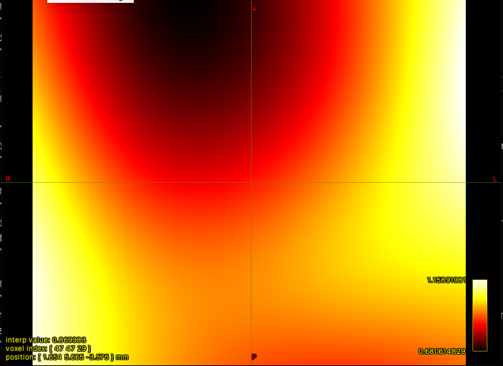

### 2.6. Brain mask estimation
```console
dwi2mask dwi_den_unr_preproc_unbiased.mif mask_den_unr_preproc_unb.mif
```
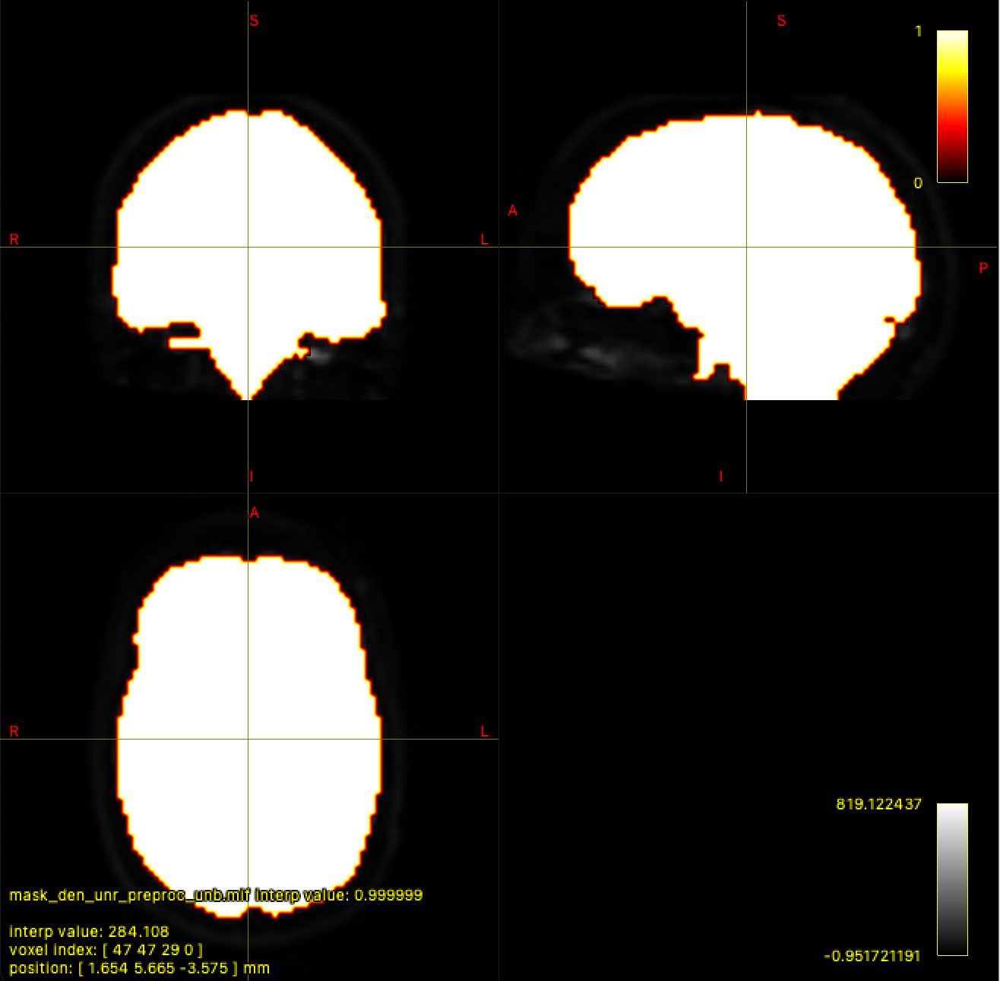

## 3 Fiber orientation distribution
### 3.1. Response function estimation

```console
dwi2response dhollander dwi_den_unr_preproc_unbiased.mif wm.txt gm.txt csf.txt -voxels voxels.mif
```

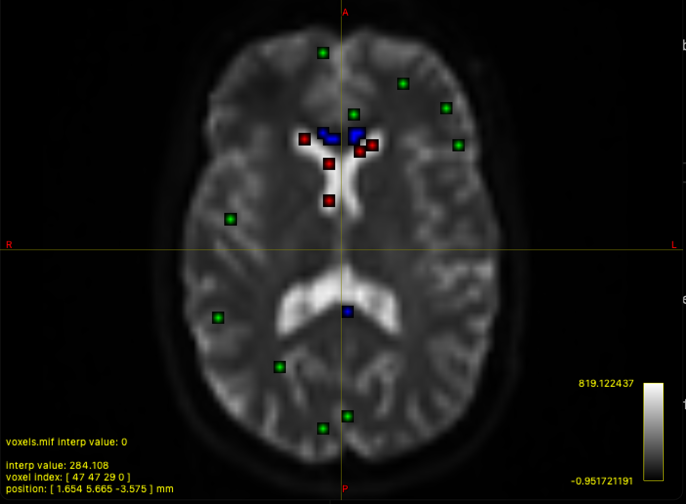

shview wm.txt  | -  |  -
:----------------:|:-------------------:|:-------------------
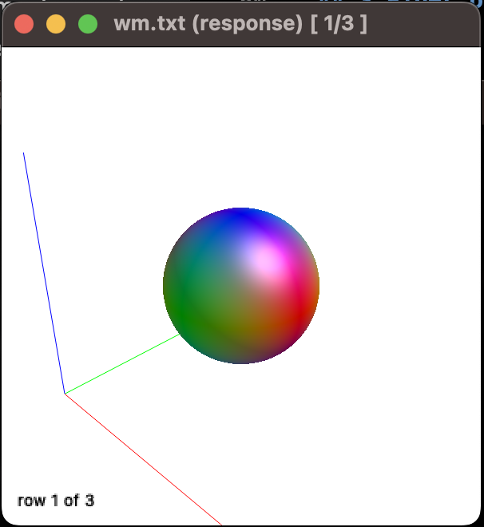  |  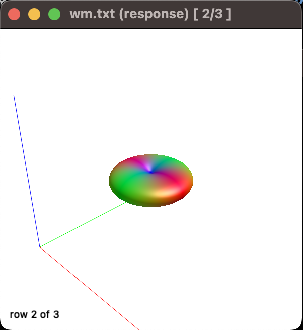  |  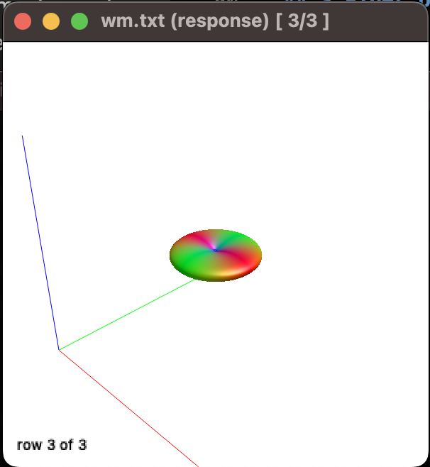

shview gm.txt  |  -  |  -
:----------------:|:-------------------:|:-------------------
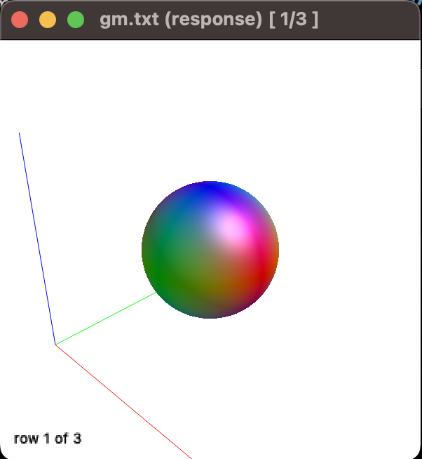  |  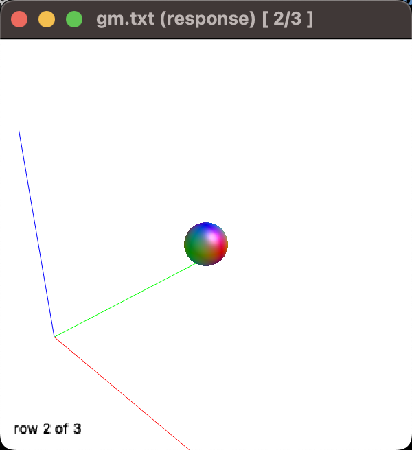  |  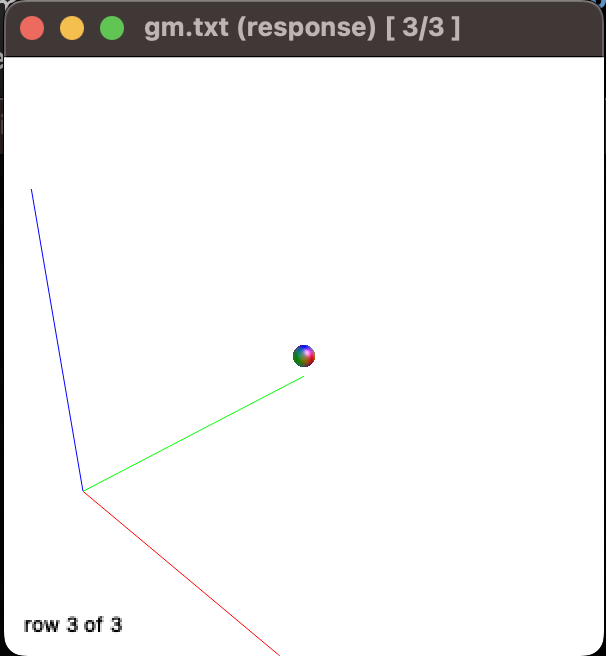

shview csf.txt   |   -   |  -
:-----------------:|:--------------------:|:-------------------
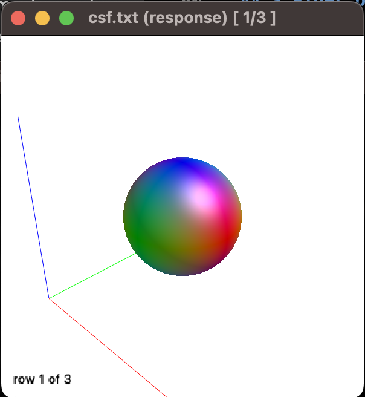  |  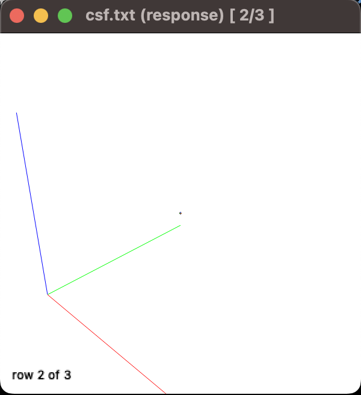  |  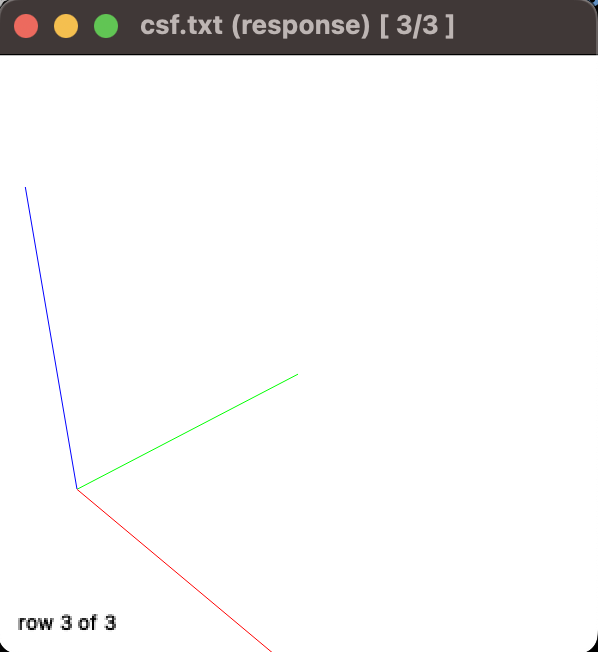

### 3.2. Estimation of Fiber Orientation Distributions (FOD)
```console
dwi2fod msmt_csd dwi_den_unr_preproc_unbiased.mif -mask mask_den_unr_preproc_unb.mif wm.txt wmfod.mif gm.txt gmfod.mif csf.txt csffod.mif
```

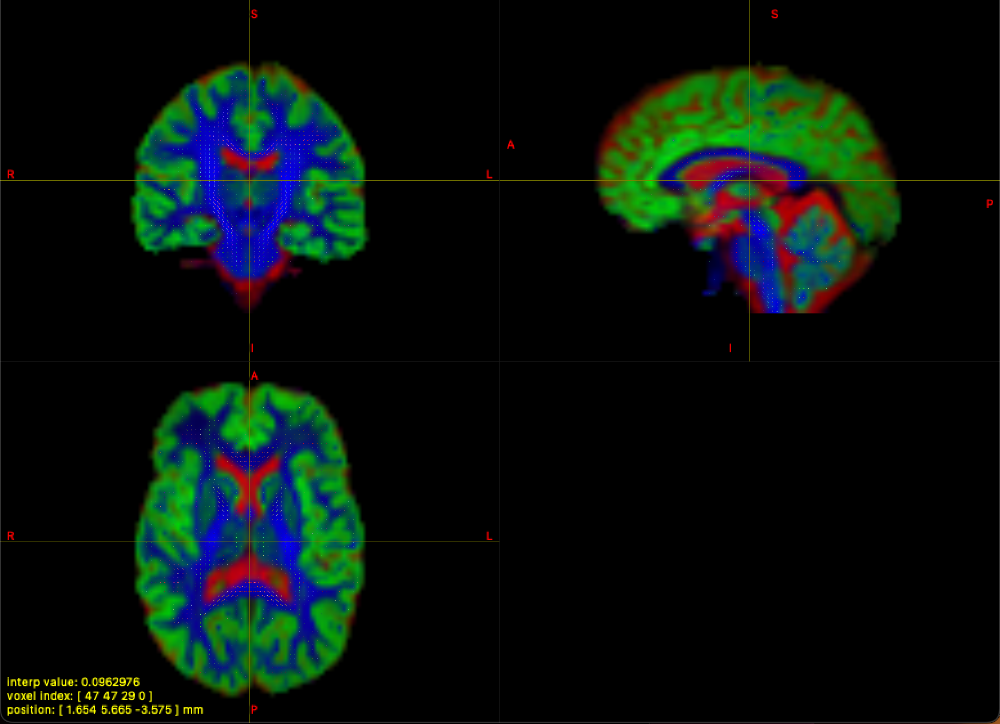

### 3.4. Intensity Normalizationw
```console
mtnormalise wmfod.mif wmfod_norm.mif gmfod.mif gmfod_norm.mif csffod.mif csffod_norm.mif -mask mask_den_unr_preproc_unb.mif
```

## 4. Creating a whole-brain tractogram

### 4.1. Preparing Anatomically Constrained Tractography (ACT)

#### 4.1.1. Preparing a mask for streamline termination

Converting T1 iamge from .nii.gz format to .mif

```console
mrconvert mprage.nii.gz T1_raw.mif
```

```console
5ttgen fsl T1_raw.mif 5tt_nocoreg.mif
```

```console
dwiextract dwi_den_unr_preproc_unbiased.mif - -bzero | mrmath - mean mean_b0_preprocessed.mif -axis 

mrconvert mean_b0_preprocessed.mif mean_b0_preprocessed.nii.gz

mrconvert T1_raw.mif T1_raw.nii.gz

flirt -in mean_b0_preprocessed.nii.gz -ref T1_raw.nii.gz -dof 6 -omat diff2struct_fsl.mat

transformconvert diff2struct_fsl.mat mean_b0_preprocessed.nii.gz T1_raw.mif flirt_import diff2struct_mrtrix.txt

mrtransform T1_raw.mif -linear diff2struct_mrtrix.txt -inverse T1_coreg.mif

mrtransform 5tt_nocoreg.mif -linear diff2struct_mrtrix.txt -inverse 5tt_coreg.mif
```


#### 4.1.2 Preparing a mask of streamline seeding
```console
5tt2gmwmi 5tt_coreg.mif gmwmSeed_coreg.mif
```

### 4.2 Creating streamlines
Creating 10 million streamlines:
```console
tckgen -act 5tt_coreg.mif -backtrack -seed_gmwmi gmwmSeed_coreg.mif -select 10000000 wmfod_norm.mif tracks_10mio.tck
```

### 4.3 Reducing the number of streamlines
```console
tcksift –act 5tt_coreg.mif –term_number 1000000 tracks_10mio.tck wmfod_norm.mif sift_1mio.tck
```

### 4.4 Region-of-interest filtering of tractogramsc
```console
tckedit –include -0.6,-16.5,-16.0,3 sift_1mio.tck cst.tck
```

## 5. Connectome construction

#### 5.2 Matrix generation
```console
tck2connectome -symmetric -zero_diagonal -scale_invnodevol sift_1mio.tck schaefer2018_200_parcels_coreg.mif schaefer200.csv -out_assignment assignments_schaefer200.csv -force
```


### 5.3 Selecting connections of interest

## 8. Preparing a parcellation image for structural connectivity analysis
You need to install FreeSurfer

```console
export FREESURFER_HOME=/Applications/freesurfer/7.3.2
source $FREESURFER_HOME/SetUpFreeSurfer.sh
```

### 8.1 Convert the raw T1.mif image to nifti-format
```console
mrconvert T1_raw.mif T1_raw.nii.gz
```

### 8.2 Preprocess the T1 image in FreeSurfer
```console
recon-all –s brain –i T1_raw.nii.gz –all
```

```console
mri_surf2surf --hemi lh \                
--srcsubject fsaverage \
--trgsubject brain \
--sval-annot /Users/aringuyen/Downloads/Parcellations/FreeSurfer5.3/fsaverage/label/lh.Schaefer2018_200Parcels_17Networks_order.annot \
--tval $SUBJECTS_DIR/brain/label/lh.Schaefer2018_200Parcels_17Networks_order.annot
```

### 8.3. Map the annotation files of the HCP MMP 1.0 atlas fromfsaverage to you subject for both hemispheres

```console
mri_surf2surf --hemi rh \                
--srcsubject fsaverage \
--trgsubject brain \
--sval-annot /Users/aringuyen/Downloads/Parcellations/FreeSurfer5.3/fsaverage/label/rh.Schaefer2018_200Parcels_17Networks_order.annot \
--tval $SUBJECTS_DIR/brain/label/rh.Schaefer2018_200Parcels_17Networks_order.annot
```

### 8.4. Map the HCP MMP 1.0 annotations onto the volumetric image and add (FreeSurfer-specific) subcortical segmentation. Convert the resulting file to .mif format (use datatype uint32, which is liked best by MRtrix).

```console
mri_aparc2aseg --old-ribbon --s brain --o schaefer2018_200.mgz --annot Schaefer2018_200Parcels_17Networks_order

mrconvert –datatype uint32 schaefer2018_200.mgz schaefer2018_200.mif
```

### 8.5. Replace the random integers of the hcpmmp1.mif file with integers
that start at 1 and increase by 1.

```console
labelconvert schaefer2018_200.mif $FREESURFER_HOME/FreeSurferColorLUT.txt /Users/aringuyen/Desktop/Parcellations/MNI/freeview_lut/Schaefer2018_200Parcels_17Networks_order.txt schaefer2018_200_parcels_nocoreg.mif
```


### 8.6. Register the ordered atlas-based volumetric parcellation to diffusion space.

```console
mrtransform schaefer2018_200_parcels_nocoreg.mif -linear diff2struct_mrtrix.txt -inverse -datatype uint32 schaefer2018_200_parcels_coreg.mif
```

