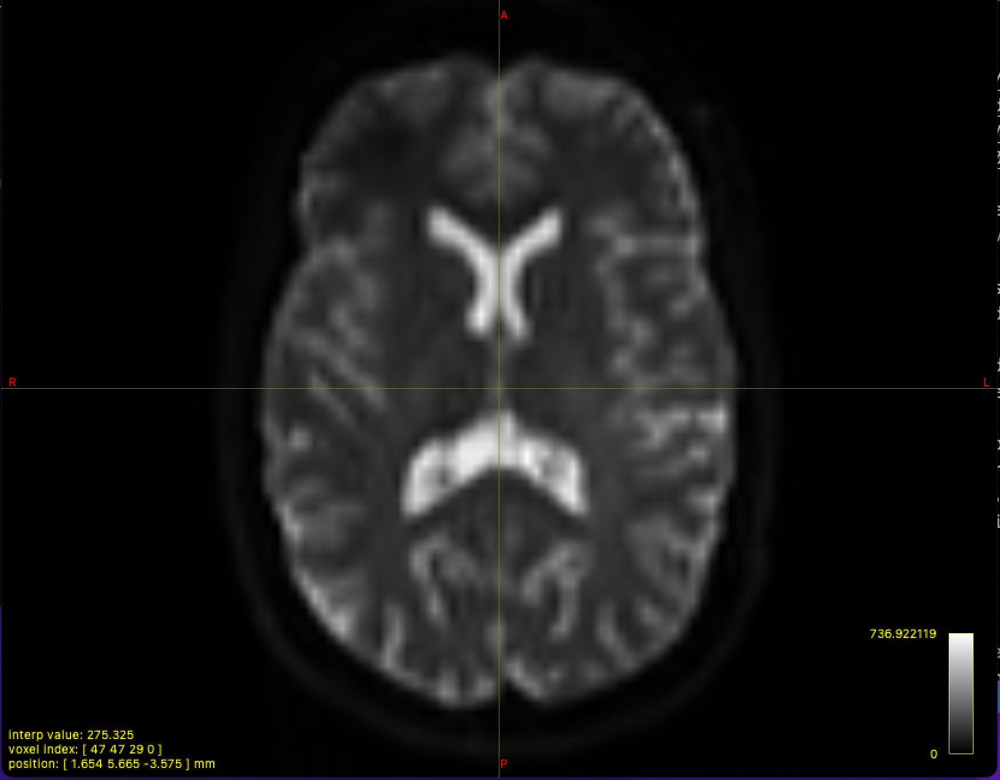
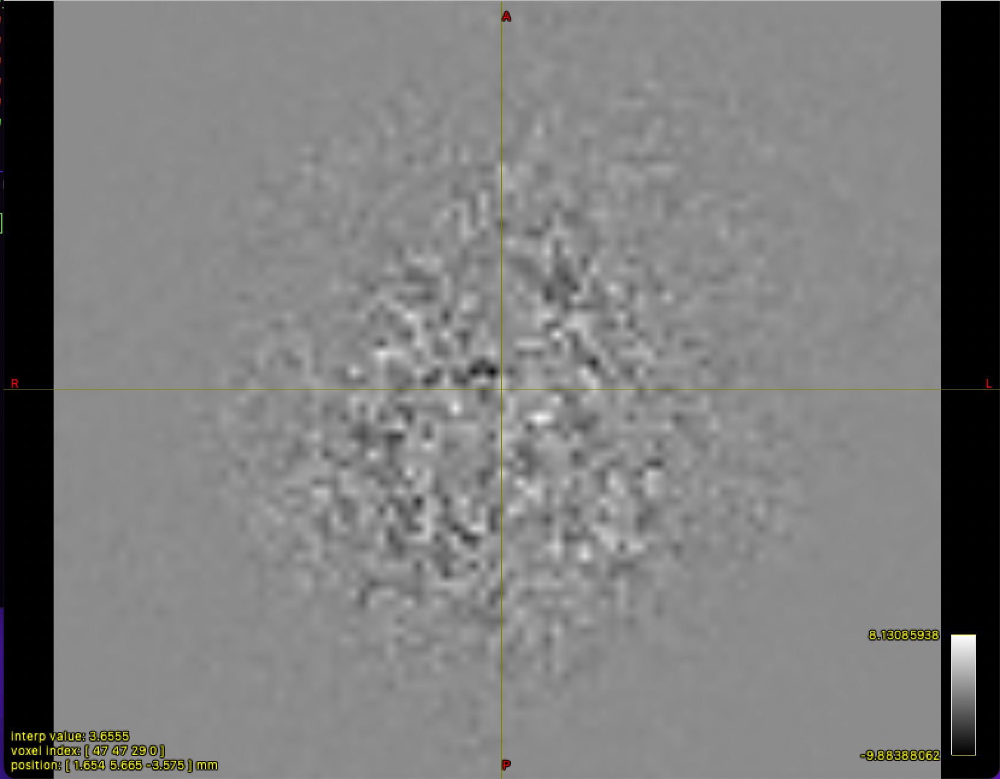
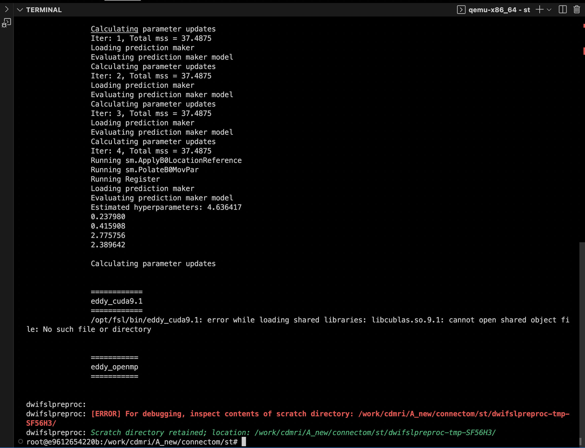

# Dataset 1 - State-of-art Protocol

## 1. Preprocessing .nii to .mif file format 

https://andysbrainbook.readthedocs.io/en/latest/MRtrix/MRtrix_Course/MRtrix_03_DataFormats.html

- We use the command ``mrconvert`` to combine the raw diffusion data with its corresponding .bval and .bvec files, so that we can use the combined file for future preprocessing steps:

```console
mrconvert dwi.nii.gz dwi_raw.mif -fslgrad dwi.bvec dwi.bval
```



## 2. Denoising
```console
dwidenoise dwi_raw.mif dwi_den.mif –noise noise.mif
```

```console
mrcalc dwi_raw.mif dwi_den.mif –subtract residual.mif
```

dwi_den.png            |  residual.png
:---------------------:|:-------------------------:
  |  !

## 3. Unringing
Remove Gibb’s ringing artefacts:
```console
mrdegibbs dwi_den.mif dwi_den_unr.mif –axes 0,1
```

Calculate the difference between the denoised image and the unringed image:
```console
mrcalc dwi_den.mif dwi_den_unr.mif '–subtract' residualUnringed.mif
```

dwi_den_unr.png           |  residual_unr.png
:------------------------:|:-------------------------:
  |  !

## 4 Motion and distortion correction

In BATMAN tutorial, ``-rpe_pair`` is used but here we're using ``-rpe_none`` because it's stated that a reversed phase encoding b0 image was not available (section 4.2 of [Cross-scanner and cross-protocol diffusion MRI data harmonisation: A benchmark database and evaluation of algorithms](https://www.sciencedirect.com/science/article/pii/S1053811919300837)). 

More information about these keywords can be found [here](https://mrtrix.readthedocs.io/en/3.0_rc1/reference/scripts/dwipreproc.html)

```console
dwifslpreproc dwi_den_unr.mif dwi_den_unr_preproc.mif -rpe_none -pe_dir AP -eddy_options " --slm=linear"
```

**Current Problem:** 

The current problem I ran to is that this command doesn't work. ``eddy_openmp`` keeps running and not progress. At one point, the pipeling of ``dwifslpreproc`` broke



**Thoughts on how to solve:** 
- I'm using Docker container and it might not enough memory/power to run ``eddy_openmp``. So I'm thinking uploading Docker container image to AWS or Google Clound machine to see if it's working.