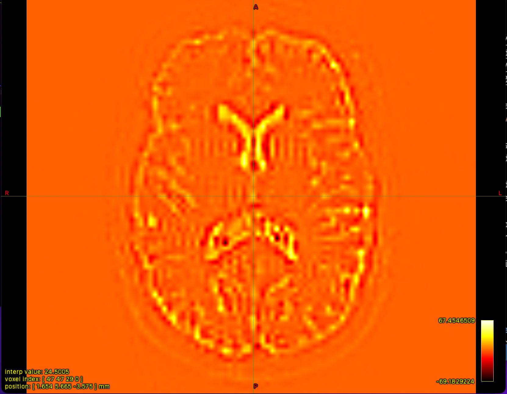

# Dataset 1 - Standard (ST) Protocol

## 1. Overview
Below are the command we're using to process standard protocol dataset of person A 

## 2. Preprocessing

### 2.1. Preprocessing .nii to .mif file format 

https://andysbrainbook.readthedocs.io/en/latest/MRtrix/MRtrix_Course/MRtrix_03_DataFormats.html

- We use the command ``mrconvert`` to combine the raw diffusion data with its corresponding .bval and .bvec files, so that we can use the combined file for future preprocessing steps:

```console
mrconvert dwi.nii.gz dwi_raw.mif -fslgrad dwi.bvec dwi.bval
```


### 2.2. Denoising
```console
dwidenoise dwi_raw.mif dwi_den.mif –noise noise.mif
```

```console
mrcalc dwi_raw.mif dwi_den.mif –subtract residual.mif
```

dwi_den.png            |  residual.png
:---------------------:|:-------------------------:
  |  !

### 2.3. Unringing
Remove Gibb’s ringing artefacts:
```console
mrdegibbs dwi_den.mif dwi_den_unr.mif –axes 0,1
```

Calculate the difference between the denoised image and the unringed image:
```console
mrcalc dwi_den.mif dwi_den_unr.mif –subtract residualUnringed.mif
```

dwi_den_unr.png           |  residual_unr.png
:------------------------:|:-------------------------:
  |  !

### 2.4 Motion and distortion correction

In BATMAN tutorial, ``-rpe_pair`` is used but here we're using ``-rpe_none`` because it's stated that a reversed phase encoding b0 image was not available (section 4.2 of [Cross-scanner and cross-protocol diffusion MRI data harmonisation: A benchmark database and evaluation of algorithms](https://www.sciencedirect.com/science/article/pii/S1053811919300837)). 

More information about these keywords can be found [here](https://mrtrix.readthedocs.io/en/3.0_rc1/reference/scripts/dwipreproc.html)

```console
dwifslpreproc dwi_den_unr.mif dwi_den_unr_preproc.mif -rpe_none -pe_dir AP -eddy_options " --slm=linear"
```

### 2.5. Bias field correction

```console
dwibiascorrect ants dwi_den_unr_preproc.mif dwi_den_unr_preproc_unbiased.mif -bias bias.mif
```


### 2.6. Brain mask estimation
```console
dwi2mask dwi_den_unr_preproc_unbiased.mif mask_den_unr_preproc_unb.mif
```


## 3 Fiber orientation distribution
### 3.1. Response function estimation

```console
dwi2response dhollander dwi_den_unr_preproc_unbiased.mif wm.txt gm.txt csf.txt -voxels voxels.mif
```


```console
shview wm.txt
```

```console
shview gm.txt
```

```console
shview csf.txt
```

dwi_den_unr.png   |  residual_unr.png   |  residual_unr.png
:----------------:|:-------------------:|:-------------------
  |    |  

dwi_den_unr.png   |  residual_unr.png   |  residual_unr.png
:----------------:|:-------------------:|:-------------------
  |    |  

dwi_den_unr.png    |  residual_unr.png    |  residual_unr.png
:-----------------:|:--------------------:|:-------------------
  |    |  

### 3.2. Estimation of Fiber Orientation Distributions (FOD)
```console
dwi2fod msmt_csd dwi_den_unr_preproc_unbiased.mif -mask mask_den_unr_preproc_unb.mif wm.txt wmfod.mif gm.txt gmfod.mif csf.txt csffod.mif
```


### 3.4. Intensity Normalization
```console
mtnormalise wmfod.mif wmfod_norm.mif gmfod.mif gmfod_norm.mif csffod.mif csffod_norm.mif -mask mask_den_unr_preproc_unb.mif
```

## 4. Creating a whole-brain tractogram

```console
dwiextract dwi_den_unr_preproc_unbiased.mif - -bzero | mrmath - mean mean_b0_preprocessed.mif -axis 
```

```console
mrconvert mean_b0_preprocessed.mif mean_b0_preprocessed.nii.gz
mrconvert T1_raw.mif T1_raw.nii.gz
```

```console
```

```console
```